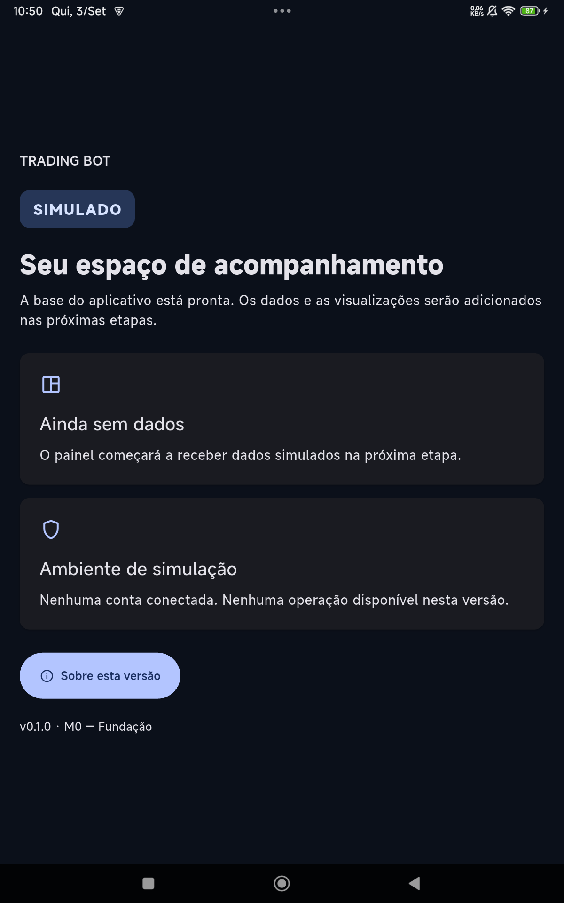
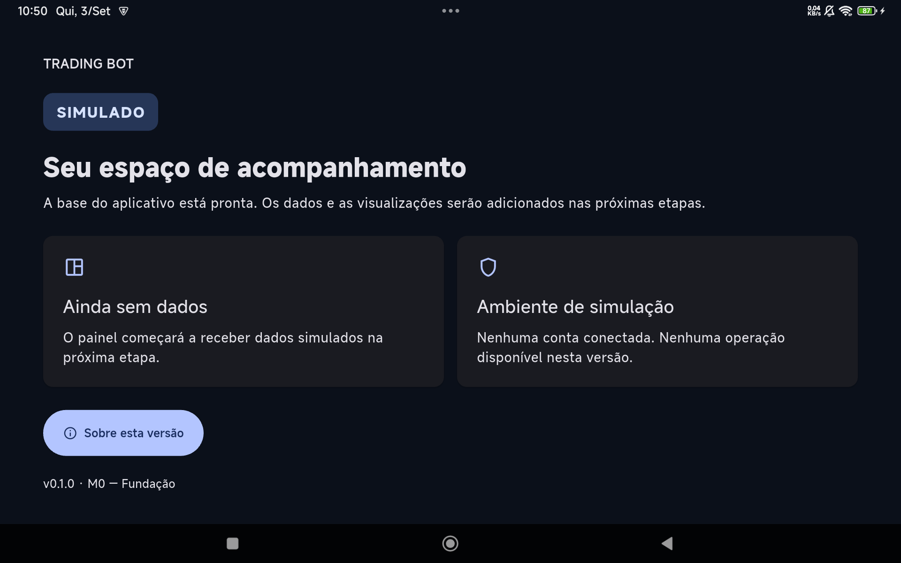

# Status — Trading Bot Dashboard v0.1

Data: 2026-09-03. Marco autorizado: **M1.5 — Real Market Data (em andamento)**. **M1 implementado e validado**. Estrutura do **M2** (Strategy/Risk) implementada, porém será temporariamente suspensa/adaptada para a integração de dados reais do M1.5.
## Implementado

- Monorepo e especificação preservada na raiz.
- Flutter mobile-first, tema escuro, `SIMULADO`, estado vazio e diálogo funcional.
- FastAPI com `/health`, contrato v1, UTC e logs JSON com `correlation_id`.
- PostgreSQL Compose em loopback; banco de testes isolado.
- SQLAlchemy, psycopg e migração Alembic baseline `0001_m0`.
- Dependências fixadas em `uv.lock` e `pubspec.lock`.
- Ruff, mypy, pytest, Flutter analyze e testes de layout/acessibilidade.
- Módulos separados e reservados para mercado, estratégia, risco e execução.
- Documentos STATUS, DECISIONS, RUNBOOK, SECURITY e DEMO.

## Ambiente detectado

| Comando | Resultado |
| --- | --- |
| `flutter --version` | Flutter 3.44.7 stable / Dart 3.12.2 |
| `py -0p` | Python 3.14.4 padrão; Python 3.12.10 instalado e selecionado para `.venv` |
| `docker version` | Client/Server 29.3.1 após recuperação; Docker Desktop 4.68.0 |
| `docker compose version` | v5.1.1 |
| `flutter doctor -v` inicial | Android SDK ausente |
| `flutter doctor -v` após instalação local | Nenhum problema; SDK 36.0.0 e licenças aceitas |
| `adb devices -l` | `1791a20e device product:xun_global model:23073RPBFG device:xun` após autorização no tablet |
| `flutter devices` | `23073RPBFG`, serial `1791a20e`, android-arm64, Android 15 / API 35 |
| `adb shell getprop ro.product.manufacturer` | Xiaomi |
| `adb shell wm size` / `wm density` | 1200×1920 pixels / 280 dpi |

O SDK foi instalado em `.tools/android-sdk` com autorização explícita do usuário para download e aceite de licença. Command-line Tools `15859902`, SHA-256 verificado: `90ae805d20434428bffcb699c290860f19bb5f66a67e6b330067e3de801fb04a`. Componentes: Platform Tools, Android 36, Build Tools 36.0.0, NDK 28.2.13676358 e CMake 3.22.1 (instalado pelo Gradle no mesmo SDK local). Variáveis somente na sessão; nenhuma alteração permanente do Flutter, PATH ou SDK global. A rotação da tela do tablet foi alterada temporariamente para inspeção e restaurada, conforme registro abaixo.

## Validações executadas

| Comando / cenário | Resultado |
| --- | --- |
| `uv sync --locked` | OK, ambiente Python 3.12.10 |
| `uv run ruff format .` e `ruff format --check .` | OK |
| `uv run ruff check .` | OK |
| `uv run mypy` | OK, 15 arquivos Python de implementação |
| `uv run pytest -m 'not integration'` | 18 passaram |
| `docker compose config --quiet` | OK |
| `docker compose up -d --wait` | PostgreSQL 17.9 saudável, bind 127.0.0.1:5432 |
| `uv run alembic upgrade head` duas vezes | OK, repetível |
| `uv run alembic current` | `0001_m0 (head)` |
| `uv run alembic check` | Nenhuma operação pendente |
| `docker compose exec -T postgres psql -U trading_bot_dev -d trading_bot_dev -c 'SHOW timezone;'` | UTC |
| `docker compose --profile test up -d --wait postgres_test` | Banco isolado saudável, porta 5433 |
| `$env:RUN_DB_TESTS='1'; uv run pytest -m integration` | 1 passou; upgrade repetido, downgrade, novo upgrade e health real |
| `Invoke-WebRequest http://127.0.0.1:8000/health` | 200, `ok/up`, contrato 1.0, `SIMULADO` |
| Parar PostgreSQL e consultar `/health` | 503, `degraded/down` |
| Retomar PostgreSQL e consultar `/health` | 200, `ok/up`; volume e revisão preservados |
| `dart format lib test integration_test test_driver` e modo `--output=none --set-exit-if-changed` | OK |
| `flutter analyze --fatal-infos --fatal-warnings` | Nenhum problema |
| `flutter test` | 11 passaram: 10 combinações viewport/escala e 1 teste de acessibilidade |
| `flutter build apk --debug` | OK após instalação do SDK; primeiro build completo em 223,7 s |
| `flutter drive --driver=test_driver/integration_test.dart --target=integration_test/app_test.dart -d 1791a20e --dart-define=CAPTURE_SCREENSHOTS=true` | OK; 2 testes no tablet: portraitUp e landscapeLeft, com interação e screenshots |
| `flutter run --no-pub -d 1791a20e` | OK; lib/main.dart instalado, aberto e mantido no tablet após detach (`d`) |
| `flutter build web --no-pub` | OK, alvo auxiliar compilado; não usado como substituto do tablet |
| `./scripts/capture-tablet.ps1` | OK; screenshots físicos 1200×1920 e 1920×1200; rotação restaurada |
| `./scripts/check.ps1 -Database` | OK: checks backend + integração PostgreSQL + Flutter |
| `git check-ignore .env .venv .tools` | Todos ignorados |
| Busca de formatos comuns de tokens/chaves privadas nos arquivos do projeto | Nenhuma ocorrência; somente `.env.example` entre candidatos de ambiente/credenciais |
| Comparação SHA-256 com pacote original | PRODUCT, ARCHITECTURE, MILESTONES e IMPLEMENT idênticos; README mantém texto original e acrescenta execução M0 |

Viewports automatizados: 320×568, 390×844, 844×390, 800×1280, 1280×800; texto 1x/2x. Asserções: ausência de exceção/overflow, botão >=48 dp, abertura/fechamento do diálogo, contraste e alvos de toque Android. Resultado final: **19 testes Python (incluindo integração PostgreSQL), 11 testes de widget Flutter e 2 testes de integração Android passaram**.

## Tablet: evidências e resultado

Dispositivo principal: Xiaomi 23073RPBFG, serial `1791a20e`, Android 15 / API 35, arm64, densidade 280 dpi. `adb devices` e `flutter devices` confirmaram a conexão autorizada.

- Inicialização pelo `flutter run`: sem crash; Activity `dev.tradingbot.mobile_app/.MainActivity` em primeiro plano. PID final observado: 17608.
- Retrato: imagem física 1200×1920, cards empilhados, textos completos e legíveis, botão visível.
- Paisagem: imagem física 1920×1200, cards lado a lado, textos e botão visíveis.
- Nenhum overflow nas capturas ou testes. Busca no logcat do PID do aplicativo sem `FATAL EXCEPTION`, `Unhandled Exception` ou `A RenderFlex overflowed`.
- Botão com mínimo de 56 dp de altura no tema; testes exigem pelo menos 48×48 dp. “Sobre esta versão” abriu e “Entendi” fechou nos testes físicos. Toque adicional via ADB confirmado no aplicativo normal e screenshot do diálogo.
- O Android apresentou uma janela retrato reduzida quando apenas a Activity pediu orientação enquanto o tablet permanecia fisicamente em paisagem. Como o usuário não podia girá-lo, foi necessário usar temporariamente `adb shell wm user-rotation lock 0` e `lock 1`, com restauração em `finally` pelo script de captura. Antes/depois: `wm user-rotation=free`, `accelerometer_rotation=1`, `user_rotation=0`. Nenhuma preferência permanente de rotação foi alterada.
- Aplicativo deixado aberto; API e PostgreSQL de desenvolvimento permanecem disponíveis localmente.

Capturas reais revisadas visualmente:

| Retrato | Paisagem | Interação |
| --- | --- | --- |
| [1200×1920](evidence/tablet-full-portrait.png) | [1920×1200](evidence/tablet-full-landscape.png) | [Diálogo aberto](evidence/tablet-dialog.png) |

## Problemas encontrados e ações

1. Android SDK e ADB ausentes. ADB portátil detectou o tablet como `unauthorized`; usuário autorizou no dispositivo, que passou a `device`. SDK oficial instalado localmente após aprovação; `flutter doctor` passou.
2. Docker não iniciava por sockets NTFS inacessíveis. Primeira tentativa de renomear o socket individual falhou. Encerrados os processos Docker e executado `wsl --terminate docker-desktop`; pastas de sockets foram renomeadas para preservar conteúdo. Depois disso o motor respondeu e o Compose iniciou PostgreSQL. Sem factory reset, exclusão de volumes, imagens ou configurações.
3. Ruff encontrou linhas longas nos testes: corrigidas pela formatação. Mypy encontrou comentário ignore desnecessário: removido. Teste Flutter deixou handle de semântica ativo: encerramento corrigido com `try/finally`. Todas essas verificações passaram na reexecução.
4. Cliente de teste `httpx` substituído por `httpx2`, conforme suporte da versão instalada do Starlette; aviso correspondente resolvido. Permanece um aviso de depreciação no próprio Starlette 1.6.0, que referencia `anyio.abc.BlockingPortal`. Todos os testes passam; aviso não ocultado e código de terceiros não alterado.
5. Ao ajustar capturas, uma tentativa chamou `revertFlutterImage` como método público inexistente e o build de teste falhou. Corrigido separando os casos por orientação e usando a restauração automática do `integration_test` no teardown. Nova análise e build de integração passaram. A imagem reduzida de retrato foi identificada como janela de compatibilidade do Android; captura física em tela cheia confirmou o layout.
6. Primeiro build Android emitiu aviso de versões XML do SDK; sdkmanager anunciou depreciação da CLI legada. Instalação e builds concluíram. Logs do fabricante Xiaomi e avisos de frames no startup debug não representam validação de desempenho sustentado; desempenho contínuo fica para estabilização da v0.1.
7. Build Web auxiliar passou e emitiu aviso do tree-shaker sobre a fonte CupertinoIcons ausente. A tela M0 usa somente Material Icons, presentes e revisados no dispositivo principal. Nenhum ícone Cupertino é utilizado pelo código do aplicativo; o aviso foi preservado, sem acrescentar dependências visuais não utilizadas.

Pastas preservadas na recuperação:

- `C:/Users/vitor/AppData/Local/Docker/run.stale-20260903103306`
- `C:/Users/vitor/AppData/Local/Docker/run.stale-20260903103549`
- `C:/Users/vitor/AppData/Local/docker-secrets-engine.stale-20260903103549`

Referência do erro observado: [Docker desktop-feedback #460](https://github.com/docker/desktop-feedback/issues/460).

## Critérios de aceite do M0

| Critério | Evidência | Resultado |
| --- | --- | --- |
| Monorepo organizado | Estrutura recomendada, especificação preservada e módulos separados | OK |
| Compose inicia dependências | PostgreSQL real saudável; recuperação após parada sem perder revisão | OK |
| Backend responde `/health` | 200 com banco pronto; 503 real com banco parado; volta a 200 | OK |
| Migrações reproduzíveis | Upgrade repetido, downgrade e upgrade no PostgreSQL isolado | OK |
| App abre em celular e tablet | Viewports de telefone automatizados; tablet físico em ambas as orientações | OK |
| Lint, formatação, tipagem e testes | Ruff, mypy, Flutter analyze e 32 testes totais passando | OK |
| Sem segredos reais | `.env` ignorado, valores fictícios, nenhuma integração externa | OK |
| Documentação local | README e cinco documentos permanentes com comandos/resultados | OK |

## Limitações e próxima ação

- Aplicação M0 local: sem autenticação, consumo de API no Flutter, dados de mercado, gráficos, estratégia, risco ativo ou execução. Essas ausências são o limite deliberado do marco.
- Celular validado por testes de viewport; nenhum celular físico conectado. Tablet é o dispositivo físico de aceite.
- Build Android de debug; sem assinatura de distribuição, build iOS ou publicação.
- Avisos de dependências descritos acima são não bloqueantes; não há teste ou build obrigatório falhando no estado final.
- Recuperação do Docker resolveu o ambiente observado, mas não corrige o bug do produto Docker. Diretórios de sockets anteriores foram preservados, não removidos.
- Git local já existia sem commits e sem remote. Nada foi publicado ou enviado para GitHub.

Após o M1 ser aceito e a estrutura base do M2 ser criada, o foco agora muda para o **M1.5 — Real Market Data**, integrando a API da Alpaca mantendo o projeto na fase de testes em tempo real sem ordens reais.
